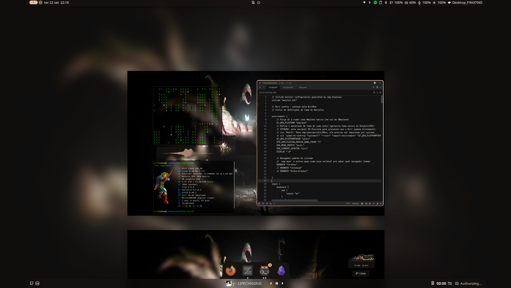

# Goat.files

Personal configuration files for a Linux desktop based on **Niri**, **Noctalia**,
**Kitty**, and **Fastfetch**, with a dark aesthetic, transparency, and references
to Arch Linux and Zelda.

> This repository contains personal configuration files. Review the files before
> applying them to your system, and adapt paths, hardware, keyboard, and default
> applications as needed.

## Preview



## Contents

| Directory | Description |
| --- | --- |
| `niri/` | Niri compositor configuration and Noctalia integration |
| `noctalia/` | Noctalia shell/desktop shell configuration |
| `kitty/` | Kitty terminal configuration |
| `fastfetch/` | Fastfetch configuration, presets, themes, ASCII art, and images |
| `screenshots/` | Desktop preview images |

## Filetree

```text
.
├── fastfetch
│   ├── ascii
│   │   ├── arch.txt
│   │   ├── cat.txt
│   │   ├── rose.txt
│   │   └── triangle.txt
│   ├── images
│   │   ├── Zelda3.png
│   │   └── ZeroTwo3.png
│   ├── presets
│   │   ├── arch.jsonc
│   │   ├── ascii-art.jsonc
│   │   ├── full-info.jsonc
│   │   ├── groups.jsonc
│   │   ├── hypr.jsonc
│   │   ├── minimal.jsonc
│   │   ├── nyarch.jsonc
│   │   └── os.jsonc
│   ├── themes
│   │   └── noctalia.jsonc
│   └── config.jsonc
├── kitty
│   └── kitty.conf
├── niri
│   ├── config.kdl
│   └── noctalia.kdl
├── noctalia
│   └── config.toml
├── screenshots
│   └── main.png
└── README.md
```

## Clone

```bash
git clone https://github.com/lisboathecoder/niri-noctalia-goatfiles.git
cd niri-noctalia-goatfiles
```

## Requirements

- Linux with a Wayland session;
- [Niri](https://github.com/YaLTeR/niri);
- [Noctalia Shell](https://github.com/noctalia-dev/noctalia-shell);
- [Kitty](https://sw.kovidgoyal.net/kitty/);
- [Fastfetch](https://github.com/fastfetch-cli/fastfetch);
- `fish`, used as the Kitty default shell;
- MesloLGS Nerd Font or a font compatible with the glyphs used;
- `xhost` and `qt6ct`, used by the Niri configuration;
- `nwg-displays`, if the `monitor.kdl` file generated on the system is used.

Noctalia plugins are obtained from the sources configured in
`noctalia/config.toml`: official, community, and `rael2pac` plugins.

## Safe installation

Back up your current configurations and copy only files that do not already
exist in your user directory:

```bash
backup="$HOME/.config-backup-$(date +%Y%m%d-%H%M%S)"
mkdir -p "$backup"
cp -a "$HOME/.config/niri" "$HOME/.config/kitty" \
  "$HOME/.config/noctalia" "$HOME/.config/fastfetch" "$backup/" 2>/dev/null || true

mkdir -p "$HOME/.config"
cp -an niri kitty noctalia fastfetch "$HOME/.config/"
```

The `-n` option prevents existing files from being overwritten. To consciously
apply a change, copy the specific file after reviewing it:

```bash
less niri/config.kdl
cp niri/config.kdl "$HOME/.config/niri/config.kdl"
```

Reload Niri or restart the corresponding components after applying the
configuration. The `niri/config.kdl` file references `monitor.kdl`, which is
generated by `nwg-displays`; keep this file in the location expected by Niri.

## Notes

- The configured keyboard layout is `br`.
- The configured default browser is Firefox.
- The configuration uses `QT_QPA_PLATFORM=wayland`, a dark GTK theme, and `qt6ct`.
- Fastfetch expects its images at
  `~/.config/fastfetch/images/`.
- Some values, such as the GPU, monitors, hostname, and installed applications,
  depend on the computer where the configuration is used.

## License

No license has been defined at this time. Contact the author before
redistributing or reusing these files outside this repository.